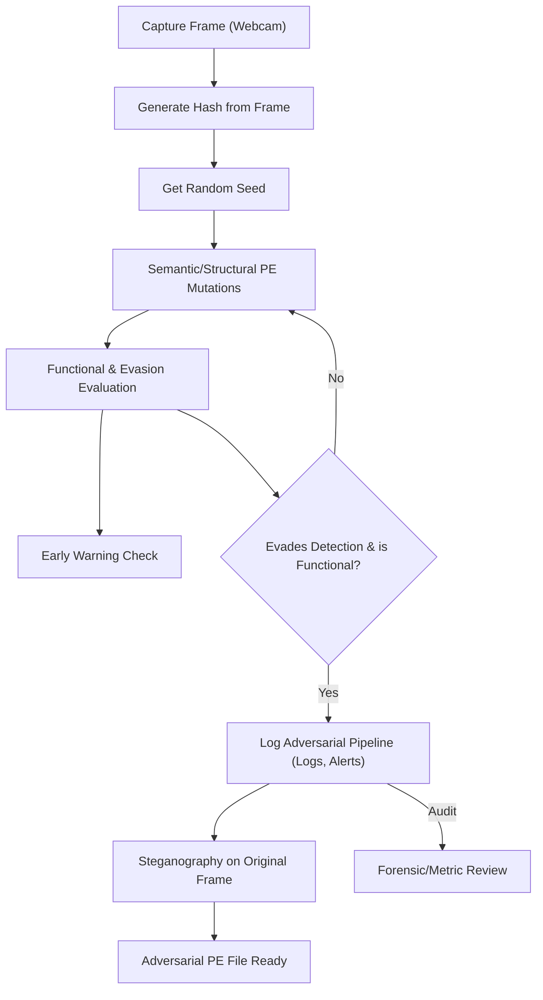

# proyecto_AICAD_JPereira

This is a practical project as an exercise for the Official Master's Degree in Compliance, Cybersecurity, and Risk Management from AICAD Unimarconi.

This project is a command-line tool to generate adversarial executables from Windows Portable Executable (PE) files. It uses a real-world entropy source (a video camera) to drive a series of mutations on an input PE file, aiming to evade detection by security software while maintaining the file's functionality.

## Architecture and Workflow

The core of the system is a feedback loop that attempts to create a mutated executable that is both functional and stealthy.



**Workflow Steps:**

1.  **Entropy Source**: A single frame is captured from a user-selected video camera.
2.  **Seed Generation**: A SHA-256 hash is generated from the raw image data. This serves as the master seed for all random operations.
3.  **Mutation & Evaluation Loop**: 
    a. A series of mutations (e.g., renaming sections, adding NOP sections with random names) are applied to the PE file, using a seed derived from the master seed.
    b. **Early Warning Evaluation**: The mutated file is checked for structural integrity and scanned by a simple signature-based detector.
    c. **Decision**: If the file is valid and not detected, the loop ends successfully. Otherwise, the changes are discarded, and a new attempt begins with a modified seed.
4.  **Output and Auditing**:
    a. The final, successful PE file is saved to the `output/` folder.
    b. The complete log of the session is hidden within the originally captured frame using steganography, and the resulting image is saved to the `output/` folder for forensic auditing.

## Installation

1.  Ensure you have Python 3.10 or higher installed.
2.  Clone this repository.
3.  It is highly recommended to create and activate a virtual environment:
    ```sh
    python3 -m venv .venv
    source .venv/bin/activate
    ```
4.  Install the dependencies:
    ```sh
    pip install -r requirements.txt
    ```

## Usage

The tool is operated via the command line. Place any PE files you wish to mutate into the `input/` folder.

**1. List Available Cameras**

To see which cameras can be used as an entropy source:
```sh
python3 main.py --list-cameras
```

**2. Run the Mutation Process**

To run the full workflow, specify the camera index and the path to the PE file.
```sh
python3 main.py --use-camera-index <CAMERA_INDEX> --pe-file input/<FILENAME.exe>
```

For example:
```sh
python3 main.py --use-camera-index 0 --pe-file input/putty.exe
```

The output files will be generated in the `output/` folder.